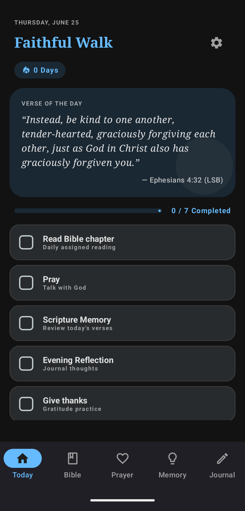
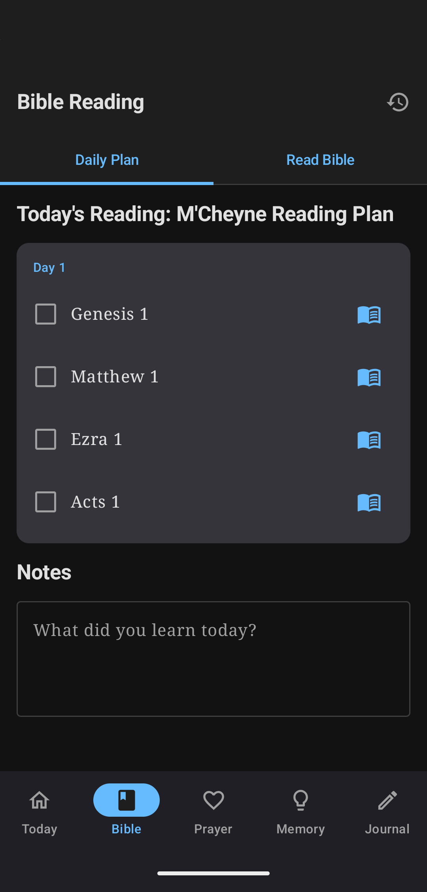
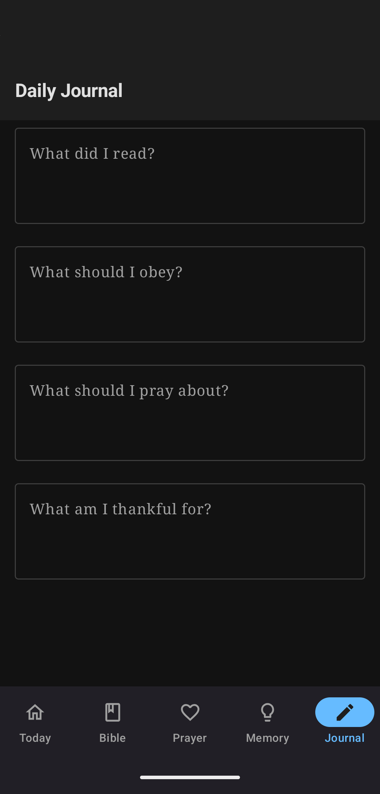
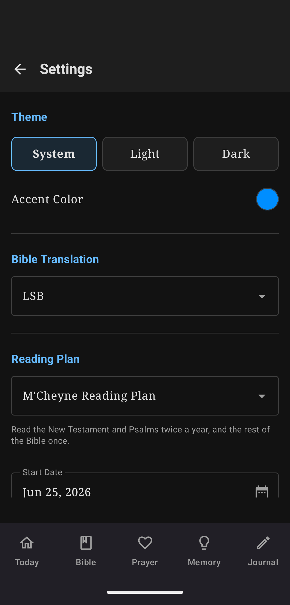

# Spiritual Disciplines

Spiritual Disciplines is an Android app for building a steady daily rhythm of Bible reading, prayer, Scripture memory, and reflection. It keeps the core practices in one place: a daily checklist, a guided reading plan, a prayer list, a memory verse review flow, and journal prompts.

## Screenshots

<table>
  <tr>
    <td align="center">
      
       
      <strong>Today</strong>
    </td>
    <td align="center">
      
       
      <strong>Bible Reading</strong>
    </td>
    <td align="center">
      
       
      <strong>Journal</strong>
    </td>
    <td align="center">
      
       
      <strong>Settings</strong>
    </td>
  </tr>
</table>

## What It Does

- Tracks daily spiritual disciplines from a single Today screen.
- Shows a verse of the day with the selected Bible translation.
- Measures daily progress and optionally displays a streak counter.
- Lets each user choose which disciplines appear on the daily checklist.
- Saves reading notes, journal entries, prayer requests, memory verses, and completion history locally.

## Main Features

### Daily Dashboard

The Today tab gives a quick picture of the day: verse of the day, checklist progress, completion count, and the enabled disciplines. The checklist can include Bible reading, prayer, Scripture memory, journaling, gratitude, praying for someone, and obeying or applying truth from Scripture.

### Bible Reading

The Bible tab combines a daily reading plan with note-taking and a built-in reader. Passages can be checked off individually, opened directly in the reader, and reviewed later through reading history notes.

Included reading plans:

- M'Cheyne Reading Plan
- Chronological Bible-in-a-Year
- The Bible Recap
- Ligonier / Tabletalk
- Navigators / Discipleship Journal Plan
- Five Day Bible Reading Program
- F-260 / Foundations 260
- BibleProject Read Scripture

### Prayer

The Prayer tab keeps active and archived prayer requests organized by category. Requests can be marked as prayed, marked as answered, edited, archived, or deleted. When there are requests still unprayed for the day, the app can start a focused prayer session and step through them one at a time.

### Scripture Memory

The Memory tab stores verses for review and practice. Verses can be added by reference, fetched in the selected translation, hidden or revealed, and reviewed with practice modes like first-letter hints and fill-in-the-blank prompts. Review difficulty updates the next review date.

### Journal

The Journal tab gives simple prompts for daily reflection:

- What did I read?
- What should I obey?
- What should I pray about?
- What am I thankful for?

### Personalization

Settings include light, dark, or system theme; accent color; Bible translation; reading plan; plan start date or current plan day; dashboard item toggles; daily reminders; and cached Bible content management.

## Purpose

The app is designed to stay quiet and practical: open it, see the next faithful step, record what was done, and keep moving through the daily rhythm without needing several separate tools.
